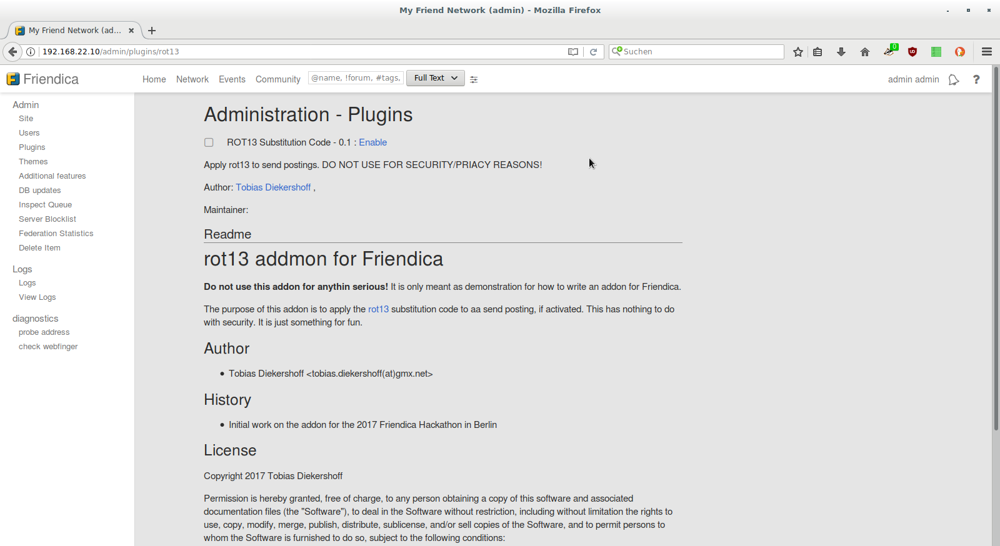
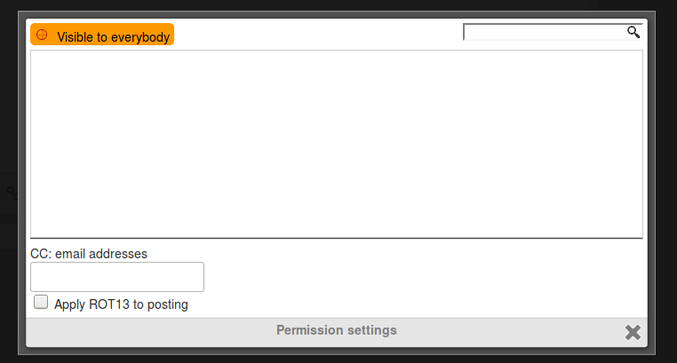
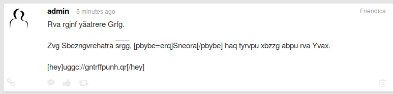

= ROT13 Addon Documentation
:author:                    Tobias Diekershoff
:title:											ROT13 Addon Documentation
:revision:                  1
:date:                      2017-11-23
:keywords:                  Friendica,addon,rot13,documentation,hackathon,2017,berlin
:subject:                   Documentation for the rot13 addon for Friendica
:lang:                      de
:encoding:                  utf-8
:doctype:                   book
:notoc:
:icons:                     font
:source-highlighter:        coderay

WARNING: The ROT13 substitution addon for Friendica is **by no means** meant to enhance the security or privacy of your postings on Friendica.

The addon was used as step-by-step example during the Friendica Hackathon 2017 in Berlin.
Its purpose is only to illustrate the steps in developing an addon for Friendica.
ROT13 was used as it is easy to use and shows some nice limitations.

== Step-by-Step usage

The git repository is tagged at five point during the addon development.
You can set the repository to any of these points using

    $> git checkout stepN

where `N` is a number from 1 to 5.
To return to the final state of the repository just checkout master.

The five steps are the following:

1. Addon header added
2. Required skeleton function added
3. Hooks registered
4. Function `rot13_jot_networks` created
5. Function `rot13_post_local` created

IMPORTANT: As this documentation was written as a final step of the addon development, it will vanish once you checked out one of the tags.
Therefore you should copy this PDF file to a different place of use the online copy.

NOTE: I have left a copy and paste error in one of the steps to be found by the dear reader.
As the addon is working it is fair to assume that it is not in the final step.

== Code Reference

The first lines of the addon contain a descriptive header with information about the addon.
These information will be shown in the admin panel in the addon overview as well as the details view of the particular addon.

The _meta_ information of the rot13 example addon contain th name, version and description.
Those will be used in the addon overview in the admin panel.
Additionally  the author of the addon is named and their Friendica profile referenced.

[source php]
.Addon Header (`rot13.php` lines 3..6)
----
include::../rot13.php[lines=3..6]
----

Each author who worked on the addon has to get their own line in the header information.

Note that the `README.md` file will displayed at the addon details page as well.
It is advised that you write such a README file containing the documentation for the addon.

You should also add a separate LICENSE file, or a LICENSE section to the README, to clarify the license of your addon.

== Required fuctions

Every addon has to implement two functions.
One for registering the needed hooks when the addon in activated and one to unregister the hooks when the addon is disabled.
These functions have to start with the directory name of the addon, in this case `rot13`.
This prefix has to be followed with either `_install` or `_uninstall`.
None of these functions does need additionally parameters.

[source php]
.Addon Hook Registration (`rot13.php` lines 14..17)
----
include::../rot13.php[lines=14..17]
----

For better read ability it is recommended to use the registered hook names in the names of the functions that will be called if the hook is triggered.
Here we register two hooks for the rot13 addon:

* `post_local`
* `jot_networks`.

For a list of available hooks and their parameters, please see https://github.com/friendica/friendica/blob/develop/doc/Plugins.md[the documentation] at github or your local Friendica node.

The `register_hook` function needs three parameters:

1. the registered hook,
2. the file which contains the function to jump to, and
3. the function name, that will be called when the hook is triggered.

The uninstall function contains almost the same content as the install function.
But it needs to call the `unregister` functions for the hook and may include additional instructions for cleaning up.

[source php]
.Addon Hook Unregistration (`rot13.php` lines 22..25)
----
include::../rot13.php[lines=22..25]
----

== Specific functions of the rot13 addon

=== rot13_jot_networks

The first function declared is `rot13_jot_networks`, the corresponding hook is used to add options to the ACL dialog of the posting.

[source php]
.jot networks function (`rot13.php` lines 30..36)
----
function rot13_jot_networks(&$a, &$b) { <1>
	if(! local_user()) { <2>
		return;
	}

	$b .= '
<input type="checkbox" name="rot13_enable" value="1" /> '
			. t('Apply ROT13 to posting') . '
'; <3>
}
----

<1> The parameter for the `jot_networks` hook are: `$a` which holds the Friendica application and `$b` which holds the HTML code for the networks added to the JOT form below the receipient selection.
<2> Here we check if the function is called within a session of a local user. If not, processing is canceled.
<3> Finally we append the current content of the network section, with a checkbox (not selected by default) and a description string for ROT13 usage. By encapsultating the help text with `t()` it is marked as translate-able and will be extracted if the translation tools of Friendica are applied to this addon. If the checkbox is ticked, the variable `rot13_enable` is set when evaluated later in `rot13_post_local`.

=== rot13_post_local

[source php]
.process a locally posted entry (`rot13.php`, lines 42..60)
----
function rot13_post_local(&$a, &$b) { <1>

	// Don't do anything if the posting is edited <2>
	if ($b['edit']) {
		return;
	}

	// only do something if the user is logged in and is the owner of the posting <3>
	if (!local_user() || (local_user() != $b['uid'])) {
		return;
	}

	$rot13_enable = ((x($_REQUEST, 'rot13_enable')) ? intval($_REQUEST['rot13_enable']) : 0); <4>

	if (!$rot13_enable) { <5>
		return;
	}
  // finally apply the ROT13	
	$b['body'] = str_rot13($b['body']); <6>
}
----

<1> Again `$a` contains the Friendica app, the second parameter `$b` contains the posted item for ths hook.
<2> The hook is triggered as well, when a posting is edited. In this case, don't re-apply the ROT13 substitution to the items body.
<3> Similar check to above, but we also check that the caller is the owner of the item.
<4> If the _Apply ROT13 to posting_ checkbox was ticked in the ACL dialog, then the `rot13_enable` variable is set. To check this the `x()` function is used in Friendica. The value of this variable is evaluated as integer and set to 0 by default.
<5> If the evaluation of the `rot13_enable` variable resulted in a value of 0, then end the processing of the function.
<6> Finally use the `str_rot13` function of PHP to substitute the content of the items body.

IMPORTANT: rot13 is only applied to US ASCII characters.
This means, that any special character outside that set, like German umlaute or square brackets used by the BBCode, will not be substituted.
This can result in undesired behaviour of the BBCode interpreter and it can give away information about the posting.

